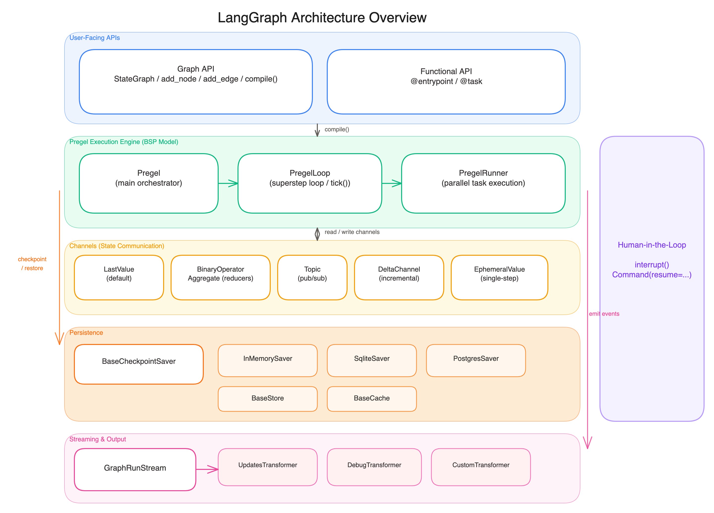

# 02 - 架构总览

## 分层架构

LangGraph 采用清晰的分层架构，从上到下依次是：



### 第一层：用户 API

两种风格，一个产物：

| API | 入口 | 编译产物 |
|-----|------|---------|
| Graph API | `StateGraph` → `.compile()` | `CompiledStateGraph` (继承自 Pregel) |
| Functional API | `@entrypoint` 装饰器 | `Pregel` 实例 |

关键认知：**不管用哪种 API，运行时都是同一个 Pregel 引擎**。API 的差异只在于"如何描述图"，不在于"如何执行图"。

### 第二层：Pregel 执行引擎

LangGraph 最核心、最复杂的模块（`pregel/` 目录下约 12,000 行代码）。

三个核心组件的职责分工：

```
Pregel (main.py, 4335 LOC)
  │  对外接口：invoke / stream / get_state / update_state
  │  管理图的整体生命周期
  │
  ├── PregelLoop (_loop.py, 1963 LOC)
  │     SuperStep 循环控制
  │     tick() — 决定下一步执行什么
  │     after_tick() — 每步结束后的收尾
  │
  └── PregelRunner (_runner.py, 941 LOC)
        单个 SuperStep 内的任务执行
        处理节点并行、错误重试
```

### 第三层：Channel（状态通信）

Channel 是 LangGraph 的**状态管理原语**。每个 State 字段都对应一个 Channel，决定了这个字段"如何被更新"：

| Channel 类型 | 行为 | 典型用法 |
|-------------|------|---------|
| `LastValue` | 新值覆盖旧值（默认） | 普通字段如 `name: str` |
| `BinaryOperatorAggregate` | 通过 reducer 聚合 | `Annotated[list, operator.add]` |
| `Topic` | Pub/Sub 多值通道 | 广播场景 |
| `EphemeralValue` | 只存活一个 SuperStep | 临时传参 |
| `DeltaChannel` | 增量存储（Beta） | 解决消息列表的 O(N^2) 存储膨胀 |

详见 [04 - Channel 机制](04-channels.md)。

### 第四层：持久化

三层持久化抽象：

```
BaseCheckpointSaver — 检查点（线程内状态快照）
  ├── InMemorySaver     开发调试
  ├── SqliteSaver       本地/小规模
  └── PostgresSaver     生产环境

BaseStore — 跨线程的 KV 存储（长期记忆）

BaseCache — 节点结果缓存
```

Checkpointer 和 Store 的区别：
- **Checkpointer** = 同一个对话线程内的状态历史（短期记忆）
- **Store** = 跨对话的持久数据（长期记忆、用户画像）

### 第五层：流式输出

流式输出不是简单地"把结果分块返回"——它是一个**转换器管道**：

```
Pregel 引擎产生原始事件
    ↓
GraphRunStream 分发
    ↓
各 Transformer 投影为不同视角：
  - UpdatesTransformer  → 每步的 state 增量
  - DebugTransformer    → 完整调试信息
  - CustomTransformer   → 用户自定义数据
  - ...
```

### 贯穿层：Human-in-the-Loop

HITL 不是某一层的功能，它**贯穿了执行引擎和持久化**：

1. `interrupt()` 在执行层抛出 `GraphInterrupt`
2. Checkpointer 保存当前状态
3. 外部系统（UI/API）读取状态、做出决策
4. `Command(resume=...)` 从 Checkpointer 恢复并继续

## 代码仓库结构

LangGraph 是一个 monorepo，包含 9 个包：

```
libs/
├── langgraph/              # 核心框架 ★
│   └── langgraph/
│       ├── graph/          # Graph 构建 API (StateGraph, add_node, add_edge)
│       ├── pregel/         # Pregel 执行引擎 (最大最复杂)
│       ├── channels/       # 状态通道 (LastValue, BinaryOperator, Delta...)
│       ├── stream/         # 流式输出 (GraphRunStream, transformers)
│       ├── func/           # Functional API (@task, @entrypoint)
│       ├── managed/        # 可注入值 (IsLastStep, RemainingSteps)
│       ├── _internal/      # 内部工具 (config, serde, retry, queue)
│       ├── types.py        # 核心类型 (interrupt, Command, Send)
│       └── errors.py       # 错误类型 (GraphInterrupt)
│
├── checkpoint/             # Checkpointer 基础库
│   └── langgraph/
│       ├── checkpoint/     # BaseCheckpointSaver, Checkpoint, 序列化
│       ├── store/          # BaseStore (跨线程 KV)
│       └── cache/          # BaseCache
│
├── checkpoint-postgres/    # PostgreSQL 实现
├── checkpoint-sqlite/      # SQLite 实现
├── checkpoint-conformance/ # 一致性测试套件
│
├── prebuilt/               # 高层预构建组件
│   └── langgraph/prebuilt/
│       ├── chat_agent_executor.py  # create_react_agent
│       ├── tool_node.py            # ToolNode
│       └── interrupt.py            # 中断工具
│
├── cli/                    # LangGraph CLI
├── sdk-py/                 # Python SDK (LangGraph Server)
└── sdk-js/                 # JS/TS SDK
```

## 数据流全景

一个典型的 Agent 调用经历的完整流程：

```
用户调用 app.invoke({"messages": [...]}, config={"thread_id": "..."})
    │
    ▼
Pregel.invoke()
    │  从 Checkpointer 加载最新 checkpoint
    │  恢复 channel 状态
    │
    ▼
PregelLoop.tick()  ── SuperStep 1 ──
    │  确定活跃节点（从 START 开始）
    │  从 channels 读取输入
    │
    ▼
PregelRunner.tick()
    │  并行执行所有活跃节点
    │  节点返回值写入 channels（经过 reducer）
    │
    ▼
PregelLoop.after_tick()
    │  创建 checkpoint（序列化所有 channel 状态）
    │  发送 stream 事件
    │  检查是否有 interrupt
    │
    ▼
PregelLoop.tick()  ── SuperStep 2 ──
    │  根据 edges 确定下一批活跃节点
    │  ...重复...
    │
    ▼
所有节点不活跃 → 返回最终 state
```

> **下一章**: [03 - 核心概念](03-core-concepts.md) — 深入理解 Graph、State、Node、Edge、Reducer
